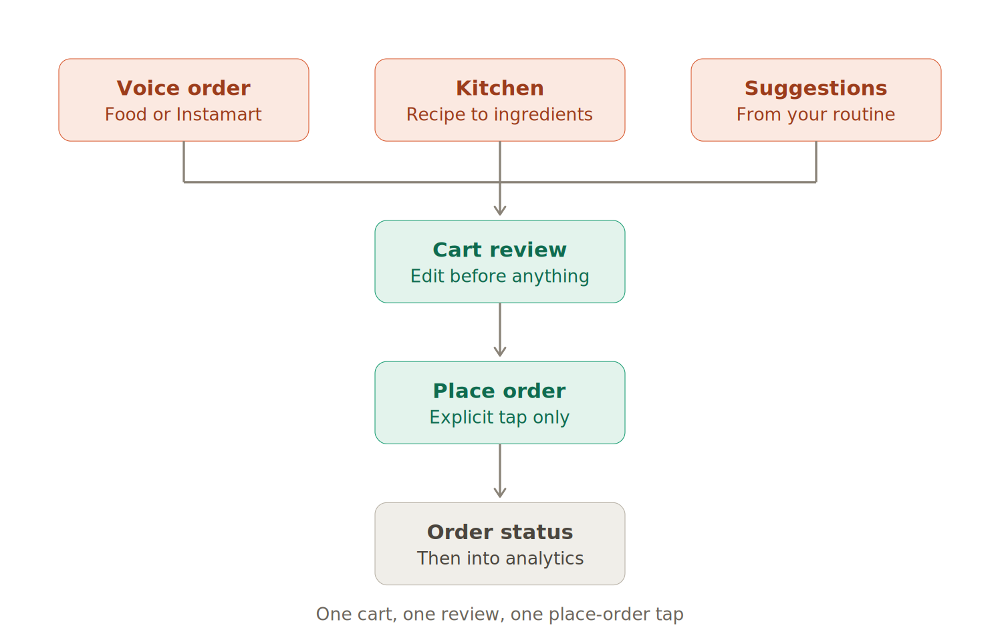
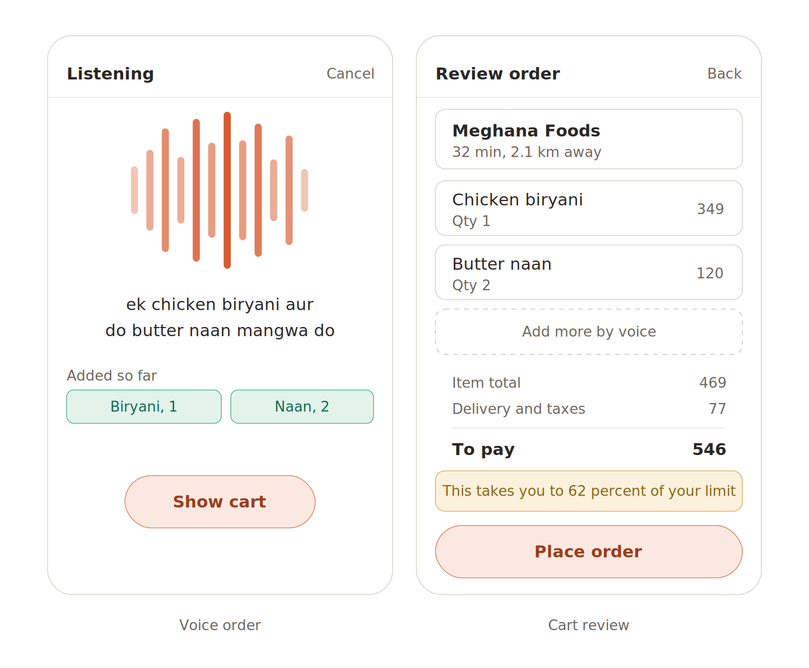
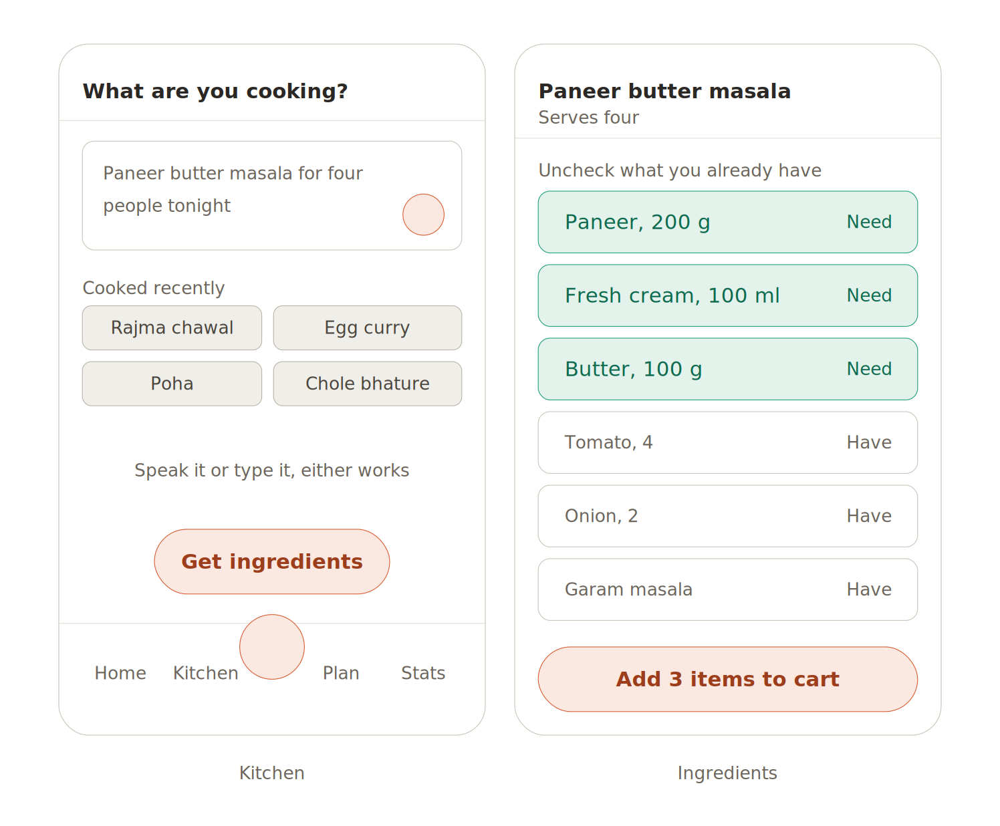
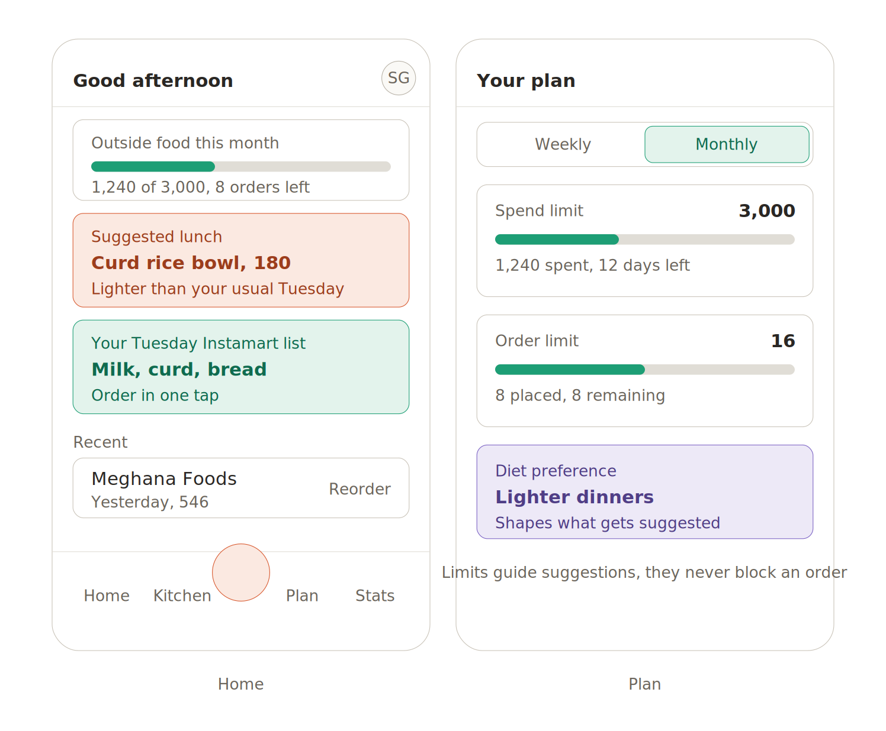
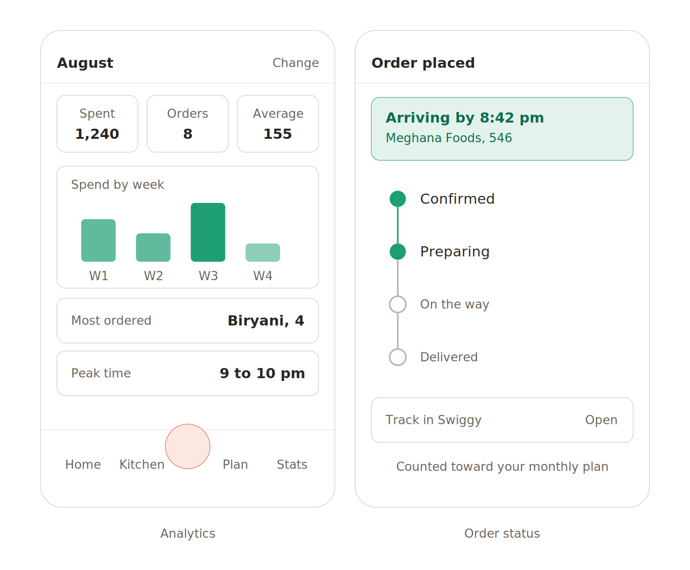

**PRODUCT REQUIREMENTS DOCUMENT**

**Voice-First Food Ordering App**

Ordering food and groceries by talking, built on Swiggy MCP. India only.

| Field | Value |
| --- | --- |
| Version | v1.0 — MVP scope |
| Date | August 2026 |
| Platform | iOS and Android, mobile only |
| Market | India, Instamart and Swiggy Food serviceable pincodes |
| Integrations | Swiggy MCP (Food, Instamart), RevenueCat |
| Screen count | 17 screens, 4 flows |
| Purpose of this doc | Design input — upload to an AI design tool or hand to a designer |

# Contents

1. Overview

2. Users and assumptions

3. Information architecture

4. Product rules

5. Core flows

6. Screen inventory and estimates

7. Screen specifications

8. Visual direction

9. Integrations and dependencies

10. Monetisation

11. Out of scope for v1

12. How to use this document for design

*Figures 1 to 5 appear in sections 3 and 5.*

# 1. Overview

The app lets a person order food and groceries by speaking naturally in Hindi, English or a mix of both. A voice agent understands the request, builds a cart through Swiggy MCP, and presents it for review. The user confirms; the app places the order.

Around that core sit three supporting capabilities: a light planning layer where the user sets weekly or monthly limits on outside food spend, a Kitchen feature that turns a dish the user wants to cook into an Instamart cart of missing ingredients, and an analytics screen that reports on ordering behaviour.

## 1.1 Problem

Ordering food on existing apps takes 15 to 30 taps across search, filters, menu browsing, customisation and checkout. Most orders are repeat orders or simple requests that the user could state in a single sentence. The tapping is overhead, not decision-making.

Separately, people who order frequently have no lightweight way to keep it in check. Existing tools are either full diet trackers, which are too heavy, or nothing at all.

## 1.2 What this is not

- Not a calorie tracker or diet app. No food logging, no macro counting, no weight goals.
- Not a journaling or wellness companion.
- Not a recipe app. Kitchen returns ingredients, not cooking instructions.
- Not a Swiggy replacement. Discovery, browsing and tracking stay in Swiggy.

## 1.3 Success criteria for v1

| Metric | Target |
| --- | --- |
| Voice request to cart, median time | Under 20 seconds |
| Cart accuracy before edits | 80 percent of items correct on first parse |
| Orders placed by voice vs manual | Over 60 percent by voice |
| Users setting a plan | 35 percent within first week |
| Kitchen carts converting to orders | 25 percent |

# 2. Users and assumptions

Primary user is a Tier-1 Indian city resident aged 22 to 38, ordering food 4 or more times a week, already using Swiggy, comfortable speaking Hinglish to a phone.

Assumptions carried into this design:

- The user has an existing Swiggy account and a serviceable address.
- Speech in mixed Hindi and English is the default input, not an edge case.
- The user is often ordering in a shared or public space, so typing must remain available.
- Instamart orders are groceries and are excluded from the outside-food plan.

# 3. Information architecture

Four tabs and one center action. Cart review, order status and settings are shared screens reached from context rather than tabs.

| Destination | Owns |
| --- | --- |
| Home | Plan status, today’s suggestions, routine Instamart list, recent orders |
| Kitchen | Dish description, ingredient list, missing-item selection |
| Talk (center) | Voice capture, disambiguation, handoff to cart |
| Plan | Weekly or monthly spend and order limits, diet preference |
| Analytics | Spend, frequency, patterns, plan adherence |

All three entry points converge on a single cart, a single review screen and a single place-order action.

*Figure 1 — Three entry points, one order path*

# 4. Product rules

These are binding constraints on every screen and flow, not preferences.

| Rule | Reason |
| --- | --- |
| The agent never places an order. It builds carts; the user taps Place order. | Real money, irreversible. One misheard confirmation loses the user permanently. |
| Full price, including delivery and taxes, is visible before the confirm tap. | Voice interfaces hide cost by nature. Nothing is spent unseen. |
| Ambiguous requests trigger a spoken choice, never a silent pick. | Picking one of twelve biryanis at four price points reads as reckless. |
| Plan limits inform, never block. | A budget that blocks dinner gets the app uninstalled. |
| Typed input reaches the same parser as voice. | Public spaces, noise, late nights, accessibility. |
| Instamart orders never count toward outside-food limits. | Groceries are not the behaviour being moderated. |

# 5. Core flows

## 5.1 Voice ordering

The primary flow and the reason the app exists.

- User taps the center circle. Voice screen opens listening immediately, no intro screen.
- User speaks. Live transcript renders as they talk; recognised items appear as chips below it.
- If a request is ambiguous, the agent asks one clarifying question with two or three named options.
- User taps Show cart, or the agent offers it once a complete request is understood.
- Cart review shows restaurant, line items with quantity, price breakdown and plan impact.
- User taps Place order. Order status screen replaces the cart.

*Figure 2 — Voice capture and cart review*

## 5.2 Kitchen

Turns an intention to cook into an Instamart cart of only the missing items.

- User describes the dish by voice or text, including serving size if relevant.
- The agent returns an ingredient list scaled to servings.
- Every ingredient defaults to Need. The user unchecks what they already have.
- Add to cart routes into the same cart review and place-order flow as voice.

*Figure 3 — Kitchen dish description and ingredient selection*

## 5.3 Plan and suggestions

The user sets a spend limit and an order-count limit per week or per month, plus a broad diet preference. The app monitors roughly against these and shapes what it suggests on Home.

- Suggestions draw on order history, day of week, time of day and remaining plan headroom.
- A routine Instamart list is offered on the day the user habitually restocks.
- Plan status appears on Home as a bar and on the cart review as a single informational line.

*Figure 4 — Home suggestions and plan limits*

## 5.4 Analytics

A read-only reporting screen covering spend, order count, average order value, spend by week, most-ordered dishes and peak ordering time, with a month selector. Plan adherence is shown as context, not as a score or grade.

*Figure 5 — Analytics and order status*

# 6. Screen inventory and estimates

17 screens total. Complexity is a design estimate: S is a simple list or form, M has custom components or multiple states, L is bespoke interaction design. Effort is design only, in days, assuming one designer.

| # | Screen | Group | Priority | Complexity | Days |
| --- | --- | --- | --- | --- | --- |
| 1 | Phone login and OTP | Onboarding | P0 | S | 0.5 |
| 2 | Address and Swiggy account link | Onboarding | P0 | M | 1.0 |
| 3 | Food preferences | Onboarding | P1 | S | 0.5 |
| 4 | Routine setup | Onboarding | P1 | M | 1.0 |
| 5 | Home | Home | P0 | L | 2.0 |
| 6 | Order history | Home | P1 | S | 0.5 |
| 7 | Voice capture | Talk | P0 | L | 2.5 |
| 8 | Disambiguation | Talk | P0 | M | 1.0 |
| 9 | Cart review | Talk | P0 | L | 2.0 |
| 10 | Kitchen dish description | Kitchen | P0 | M | 1.0 |
| 11 | Ingredient selection | Kitchen | P0 | M | 1.5 |
| 12 | Plan overview | Plan | P1 | M | 1.0 |
| 13 | Edit limits | Plan | P1 | S | 0.5 |
| 14 | Analytics | Analytics | P1 | L | 2.0 |
| 15 | Order status | Shared | P0 | M | 1.0 |
| 16 | Settings and profile | Shared | P2 | S | 0.5 |
| 17 | Paywall | Shared | P1 | M | 1.0 |

**Design total: approximately 19.5 days, or 4 weeks for one designer. P0 only is approximately 12 days.**

Add roughly 25 percent for empty, loading, error and permission states, which are listed in section 7 and are not counted above.

## 6.1 States required across screens

| State | Applies to |
| --- | --- |
| First launch, nothing ordered yet | Home, Analytics, Plan |
| Microphone permission denied | Voice capture, Kitchen |
| Speech not understood | Voice capture |
| No matching restaurant or item | Cart review, Kitchen |
| Pincode not serviceable | Onboarding, Home, cart review |
| Swiggy account not linked or expired | All ordering surfaces |
| Offline | All screens |
| Order failed after confirm | Order status |

# 7. Screen specifications

## 7.1 Home

**Purpose**

Orient the user and offer one-tap paths to likely orders.

**Components**

Greeting and avatar; plan progress bar with amount spent and orders remaining; suggested meal card with price and reason; routine Instamart list card; recent order row with Reorder; bottom navigation.

**Design notes**

Suggestion reason must be one short line. Plan bar has no failure state or red colour. Reorder skips voice and goes straight to cart review.

## 7.2 Voice capture

**Purpose**

Capture a spoken order and show what has been understood.

**Components**

Listening header with Cancel; animated waveform; live transcript, two lines maximum; recognised items as chips; keyboard toggle; Show cart button.

**Design notes**

Opens already listening. Chips appear as items are recognised, not at the end. Keyboard toggle is deliberately secondary and does not persist as a preference.

## 7.3 Disambiguation

**Purpose**

Resolve an ambiguous request without guessing.

**Components**

The ambiguous phrase echoed back; two or three named options with price and restaurant; a None of these option that reopens voice.

**Design notes**

Never more than three options. Options must differ on something the user can judge, usually price or restaurant, not on internal ranking.

## 7.4 Cart review

**Purpose**

Show exactly what will be bought and what it costs.

**Components**

Restaurant with ETA and distance; line items with quantity and price; add-more-by-voice affordance; item total, delivery and taxes, total to pay; plan impact line; Place order button.

**Design notes**

Full total always visible without scrolling. Quantity is editable inline. Plan impact is one informational line, never a warning dialog.

## 7.5 Kitchen dish description

**Purpose**

Take a free-form statement of what the user wants to cook.

**Components**

Text field with mic button; recently cooked dish chips; Get ingredients button; bottom navigation.

**Design notes**

Serving size is parsed from the description, not asked as a separate field. Recent chips are ordered by frequency.

## 7.6 Ingredient selection

**Purpose**

Let the user mark what they already have and cart the rest.

**Components**

Dish name with serving count; ingredient rows with Need or Have toggle and quantity; running count on the button.

**Design notes**

Everything defaults to Need. Toggling is a single tap on the row, not a checkbox target. Button label states how many items will be added.

## 7.7 Plan overview

**Purpose**

Show limits and current position against them.

**Components**

Weekly or monthly toggle; spend limit with progress and days remaining; order limit with progress; diet preference card; note that limits do not block.

**Design notes**

Both limits are optional and independently settable. Progress uses a neutral colour at all levels, including over limit.

## 7.8 Analytics

**Purpose**

Report ordering behaviour over a chosen month.

**Components**

Month selector; spent, orders and average metric cards; spend-by-week bar chart; most-ordered and peak-time rows.

**Design notes**

No scores, grades or judgemental language. Instamart spend is reported separately from outside food.

## 7.9 Order status

**Purpose**

Confirm the order was placed and show progress.

**Components**

Confirmation header with ETA; restaurant and total; four-stage vertical stepper; deep link to Swiggy for live tracking; plan note.

**Design notes**

Replaces cart review rather than stacking on it, so back does not return to a stale cart. Live tracking is delegated to Swiggy.

# 8. Visual direction

Starting tokens, offered as a baseline rather than a finished system. A designer should push past these.

| Token | Value | Used for |
| --- | --- | --- |
| Primary | #D85A30 warm coral | Voice action, primary buttons, brand |
| Positive | #1D9E75 green | Progress bars, confirmed states, Have and Need toggles |
| Caution | #D19A2B amber | Plan impact line, soft advisories |
| Accent | #7C63C4 violet | Preference and secondary cards |
| Ink | #2A2724 | Primary text |
| Muted | #6B655C | Secondary text, labels |
| Surface | #FFFFFF on #FAF9F6 | Cards on page background |
| Border | #C9C3B8 | Card outlines, dividers |
| Radius | 8 px cards, 22 px buttons and pills | All containers |
| Type | 14 px body semibold for values, 12 px for labels | Two sizes only, weight carries hierarchy |
| Touch target | Minimum 44 px | All interactive rows and toggles |

Tone: warm and calm, not clinical. This is an app used at 9 pm when someone is hungry and does not want to think. Avoid dashboard density, avoid gamification, avoid red.

# 9. Integrations and dependencies

| Dependency | Used for | Risk |
| --- | --- | --- |
| Swiggy MCP — Food | Restaurant and item search, cart creation, order placement, status | Access is invite-led and phased. Availability is not guaranteed on any schedule. |
| Swiggy MCP — Instamart | Grocery search, cart creation for Kitchen and routine lists | Same as above. Also limited to serviceable pincodes. |
| Speech recognition | Hinglish transcription, streamed | Mixed-language accuracy is the single largest product risk. |
| RevenueCat | Subscription entitlement for Plan and Analytics | None material. |

Design implication: every ordering surface needs a defined state for when Swiggy access is unavailable. The chosen fallback is that ordering entry points are hidden rather than shown in an error state, and Kitchen falls back to a copyable ingredient list.

# 10. Monetisation

- Free: voice ordering, Kitchen, reorder, order status. Unlimited.
- Paid: Plan limits, suggestions tuned to the plan, and Analytics.
- Entitlement is handled by RevenueCat. The paywall appears on first attempt to set a plan, not during onboarding.

Rationale: the ordering loop must be frictionless to build habit. The planning and reporting layer is where recurring value accrues, and pricing it avoids any incentive to push more orders.

# 11. Out of scope for v1

- Restaurant browsing, search and discovery.
- Live delivery tracking on a map. Deep link to Swiggy instead.
- Payment method management. Handled by Swiggy.
- Dineout, table booking and scheduled orders.
- Group ordering and shared carts.
- Calorie or nutrition estimates of any kind.
- Web or tablet layouts.

# 12. How to use this document for design

The figures in this document are structural wireframes. They fix layout hierarchy, component order and what appears on each screen. They do not fix visual style, illustration, iconography or motion, all of which are open.

Suggested prompt when handing this document to an AI design tool:

*Using the attached PRD, design high-fidelity mobile screens for this app. Follow the screen specifications in section 7 for layout and content, and the tokens in section 8 as a starting point. Design for a 390 by 844 viewport. Produce the P0 screens first: Home, Voice capture, Disambiguation, Cart review, Kitchen dish description, Ingredient selection and Order status. Keep the visual language warm and calm, avoid dashboard density, and treat the wireframes as structure rather than style.*

Open questions a designer should push on:

- What the listening state looks like when it is genuinely delightful rather than a generic waveform.
- How recognised items animate in as they are understood, which is the moment the app feels intelligent.
- How the disambiguation turn is presented so it feels helpful rather than like a failure.
- Whether Home should lead with suggestions or with the plan bar.
