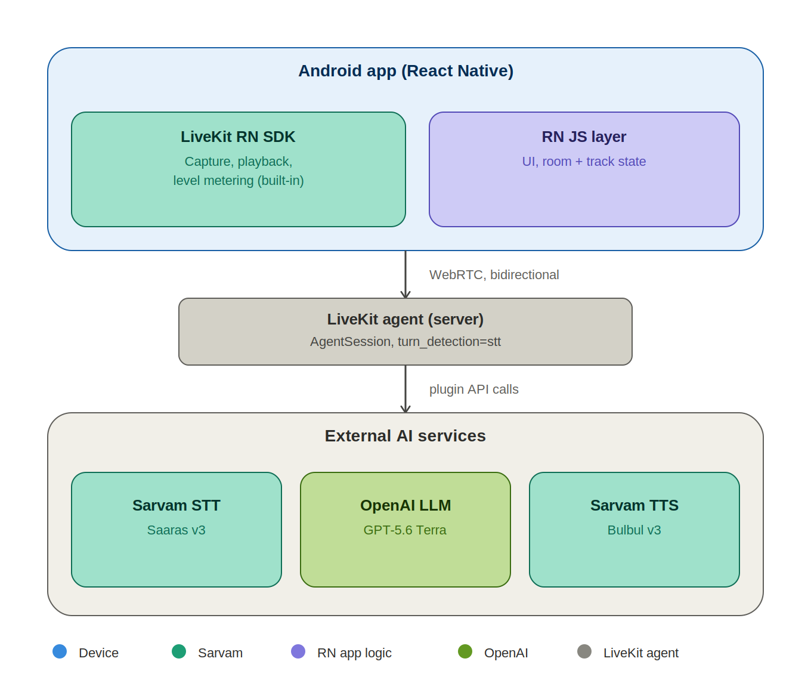
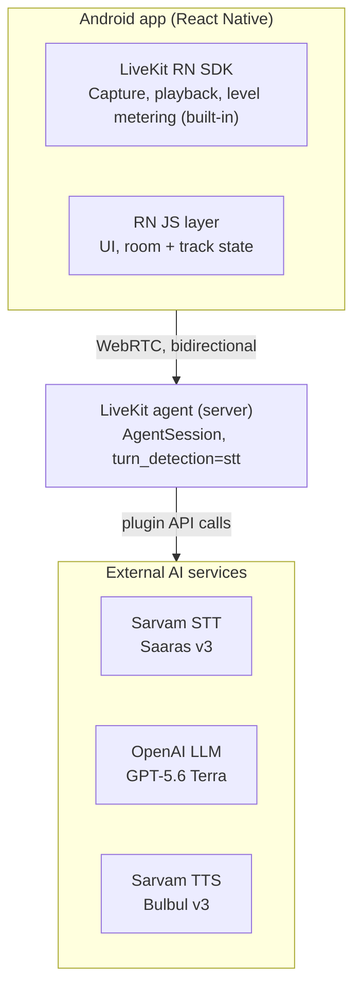

# Voice app — full architecture

Android (React Native) · LiveKit · Sarvam · OpenAI

**VoiceCart:** This is the transport and agent spine for Talk (voice ordering). Product behaviour (chips, disambiguation, Show cart, agent never places orders) is specified in the PRD and [`implementation/voice-ordering.md`](./implementation/voice-ordering.md). **Simple turn-by-turn flow:** [`voice-loop-flow.md`](./voice-loop-flow.md).

## 1. Overview

This document captures the architecture for the live voice loop: a React Native (Android-first) client for low-latency spoken conversation, backed by LiveKit for real-time transport, Sarvam AI for Indian-language speech recognition and synthesis, and OpenAI for the conversational LLM. In VoiceCart, the same loop drives order understanding and clarification; Swiggy MCP tools attach on the agent, not on the device audio path.

The design went through several iterations — starting from a turn-based record/upload pipeline, then a fully custom native-audio + raw-WebSocket architecture, and finally settling on LiveKit's client SDK and Agents framework to avoid re-implementing transport, echo cancellation, jitter buffering, and turn-taking from scratch. This document reflects that final direction.

## 2. System tiers

### 2.1 Device — Android app (React Native)

- **Transport & media:** Built with the LiveKit React Native SDK (`@livekit/react-native`), which wraps a native Android layer (Kotlin, `io.livekit:livekit-android`) bridging to Chromium's WebRTC implementation via a LiveKit fork of `react-native-webrtc`.
- **Handled by the SDK out of the box:** Audio capture, playback, echo cancellation (WebRTC AEC, on by default), noise suppression, audio session/focus management (`AudioManager` wrapper), reconnection, and adaptive bandwidth handling.
- **Level metering:** Per-track audio level events, used to drive a live mic pulse/waveform animation. No custom RMS calculation or native module needed.
- **RN JS layer:** UI screens, room/track state, transcript display, and connection status. Consumes LiveKit SDK events; does not touch raw audio.

### 2.2 Transport — LiveKit

The device connects to a LiveKit room over WebRTC — a bidirectional, low-latency media transport designed for exactly this kind of real-time audio use case, in place of a hand-rolled WebSocket audio relay.

### 2.3 Server — LiveKit Agent

A LiveKit Agent process (Python or Node) joins the same room as the device and runs an `AgentSession` that chains together speech-to-text, the LLM, and text-to-speech. Turn detection is delegated to Sarvam's STT plugin (`turn_detection="stt"`) rather than LiveKit's generic VAD, so Sarvam's own start/end-of-speech signals drive barge-in and turn-taking.

Example configuration:

```python
session = AgentSession(
    stt=sarvam.STT(model="saaras:v3", mode="transcribe", flush_signal=True),
    llm=openai.LLM(model="gpt-5.6-terra"),
    tts=sarvam.TTS(model="bulbul:v3", target_language_code="en-IN", speaker="shubh"),
    turn_detection="stt",
)
```

### 2.4 External AI services

| Service | Provider / model | Role |
| --- | --- | --- |
| Speech-to-text | Sarvam Saaras v3 | Streaming transcription with built-in VAD; drives turn detection |
| LLM | OpenAI GPT-5.6 Terra | Generates the streamed conversational reply |
| Text-to-speech | Sarvam Bulbul v3 | Streaming Indian-language voice synthesis |

### 2.5 Architecture diagram



*The three tiers: device, LiveKit agent, and external AI services.*



## 3. End-to-end turn flow

For a single conversational turn, audio and text move through the system as follows:

1. Native mic capture (via LiveKit SDK) streams audio over WebRTC to the LiveKit room.
2. The LiveKit Agent receives the audio track and forwards it to Sarvam STT.
3. Sarvam STT returns partial transcripts (UI only) and a final transcript once its VAD detects the user has stopped speaking.
4. The final transcript is sent to the OpenAI LLM, which streams back a reply token by token.
5. The agent buffers the reply into sentence-sized chunks and forwards each chunk to Sarvam TTS as soon as it's ready, rather than waiting for the full reply.
6. Sarvam TTS streams synthesized audio back progressively; the agent publishes it to the room.
7. The device plays the audio back through the LiveKit SDK, with a jitter buffer smoothing network variability.
8. If Sarvam STT's VAD detects new user speech while TTS audio is still playing, the agent cancels the in-flight TTS stream and the device flushes its playback buffer immediately — this is the barge-in / interruption path.

## 4. Key architectural decisions

### 4.1 Why LiveKit instead of custom native modules

An earlier version of this architecture called for hand-written Kotlin native modules (`AudioRecord` for capture, `AudioTrack` for playback, a custom RMS-based level meter, and a raw WebSocket client and backend orchestrator to glue STT, the LLM, and TTS together). This was replaced by LiveKit for three reasons:

- **Transport reliability:** Raw WebSocket audio has head-of-line blocking on lossy mobile networks; WebRTC (used by LiveKit) runs over UDP with jitter buffering and packet-loss handling designed for exactly this environment.
- **Engineering cost vs. benefit:** Echo cancellation, audio focus/session handling, reconnection, and interruption handling are mature, tested problems that a custom implementation would likely solve worse than an existing framework, for significant engineering time.
- **First-party integration support:** LiveKit ships an official Sarvam plugin (`@livekit/agents-plugin-sarvam` / `livekit-plugins-sarvam`) with both STT and TTS support, and a first-party OpenAI LLM plugin — the exact provider combination this app needs is a supported, documented path rather than custom glue code.

### 4.2 Why the LLM and voice models were chosen

- **LLM — OpenAI GPT-5.6 Terra:** Chosen over Claude for this build since the developer holds an OpenAI API key; GPT-5.6 Terra was selected over the flagship Sol tier (slower, more expensive, better suited to complex professional work) and the Luna tier (fastest/cheapest, for high-volume workloads) as the latency/quality balance point for real-time conversation. Reasoning/"Thinking" tier models were ruled out — their deliberation time is incompatible with low-latency voice turn-taking.
- **Voice — Sarvam Bulbul v3 (TTS) and Saaras v3 (STT):** Selected for state-of-the-art Indian-language speech quality: natural prosody, code-mixed (e.g. Hinglish) handling, and broad Indic language coverage, with WebSocket streaming for low time-to-first-byte on both STT and TTS.

### 4.3 Latency budget

Most of the end-to-end response time is inherent to the STT, LLM, and TTS models themselves and is not something the client or transport layer can reduce further. The architecture's job is to avoid adding unnecessary latency on top of that — via streaming at every stage (partial transcripts, token-streamed LLM output, progressive TTS audio) and a low-overhead transport (WebRTC) — rather than to eliminate model latency, which is fixed regardless of implementation.

## 5. What still needs to be built

Phased, independently testable build order (start with level metering): [`docs/voice-loop-build-phases.md`](./voice-loop-build-phases.md).

- **LiveKit agent (server) application code:** `AgentSession` configuration, VoiceCart ordering prompt/tools (Food MCP search + build cart only), conversation state, logging, and turn tuning (e.g. silence tolerance before end-of-turn).
- **React Native app (client):** Talk screens, LiveKit room/track integration, mic level animation driven by SDK audio-level events, transcript/chips, disambiguation UI, and connection-state UX.
- **Supporting backend (optional):** Anything outside the live voice loop itself — LiveKit token minting, accounts, call/order history, notifications — which sits alongside, not inside, the voice architecture described here.

---

*Architecture as iterated in design conversation. Applied to VoiceCart Talk via `implementation/voice-ordering.md`.*
