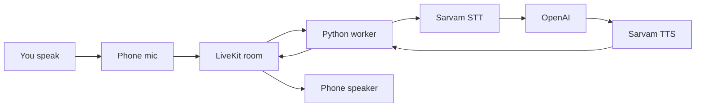

# Talk voice loop — simple flow

How Talk turns speech into a spoken reply today (Phase 4).  
**Deeper architecture:** [`voice-app-architecture.md`](./voice-app-architecture.md). **Product wiring:** [`implementation/voice-ordering.md`](./implementation/voice-ordering.md).

The phone **does not** call Sarvam or OpenAI. It only sends and plays audio. A Python worker already running on your machine does STT → LLM → TTS.

## Pieces

| Piece | What it is | What it does |
| --- | --- | --- |
| Phone (Talk) | Expo app | Mic in, speaker out. Joins a LiveKit room. |
| Token mint | `npm run token:livekit` | Gives the phone a short LiveKit pass. Asks LiveKit to send the agent into the room. |
| LiveKit Cloud | Room / WebRTC | The shared pipe. Everyone in the room hears each other’s audio. |
| Python worker | `npm run agent` (`services/talk-agent`) | Waits for a job. Joins the room. Runs STT, LLM, TTS. |
| Sarvam STT | Saaras v3 | Speech → text |
| OpenAI | LLM | Text → short reply |
| Sarvam TTS | Bulbul v3 | Reply text → speech |

The app never `fetch`es the Python process. You start the worker yourself. LiveKit **dispatches** it into the room by name (`voicecart-talk`).

## One spoken turn

1. You talk into the phone mic.
2. LiveKit sends that audio into the room.
3. The Python worker is already in the room and hears it.
4. **STT (Sarvam)** — speech → text (for example “I want biryani”).
5. **LLM (OpenAI)** — writes a short reply (for example “Got it.”).
6. **TTS (Sarvam)** — that reply → spoken audio.
7. The worker publishes that audio back into the room.
8. The phone plays it on the speaker.

Loop: **mic → STT → LLM → TTS → speaker**.

Speak again without leaving Talk → same steps, second turn.

## How the worker gets into the room

Nothing in React Native imports or HTTP-calls `agent.py`.

1. `npm run agent` starts the worker. It registers with LiveKit as `voicecart-talk` and waits.
2. You open Talk. The app asks the mint for a token.
3. The mint tells LiveKit: send agent `voicecart-talk` into `voicecart-talk-dev`.
4. LiveKit assigns that job to the waiting worker. The worker joins as another participant.
5. Talk waits until that agent is present, then shows Listening. If the worker is not running, Failed after about 15 seconds.

## What the phone does vs the worker

**Phone:** capture mic, play remote audio, orb from agent session (listening / thinking / speaking; mic level only while listening), connect / reconnect / fail UI.

**Worker:** STT, LLM, TTS, and publishing the reply audio.

Secrets (`LIVEKIT_API_SECRET`, `SARVAM_API_KEY`, `OPENAI_API_KEY`) stay in repo-root `.env.local`, not in `EXPO_PUBLIC_*`.

## Not in this loop yet

Transcript on screen, barge-in UI, order chips, Swiggy, or Place order. The agent must never place an order — that stays on cart review.
